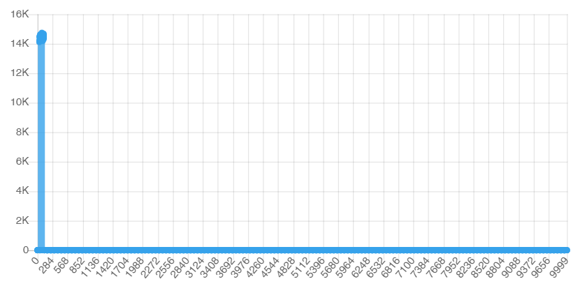
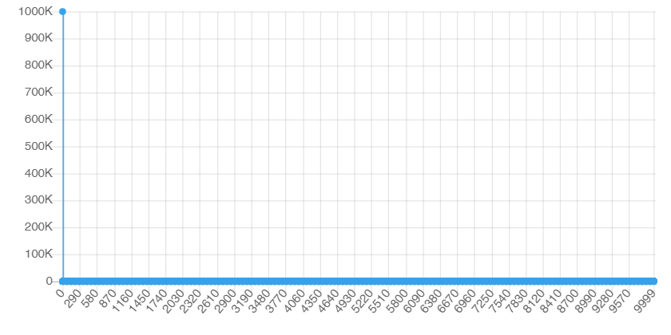
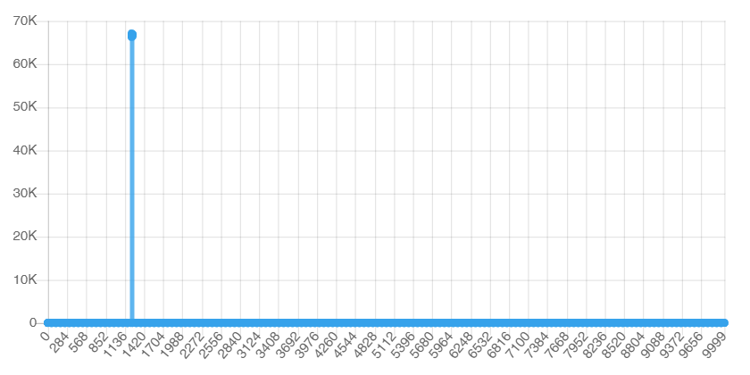
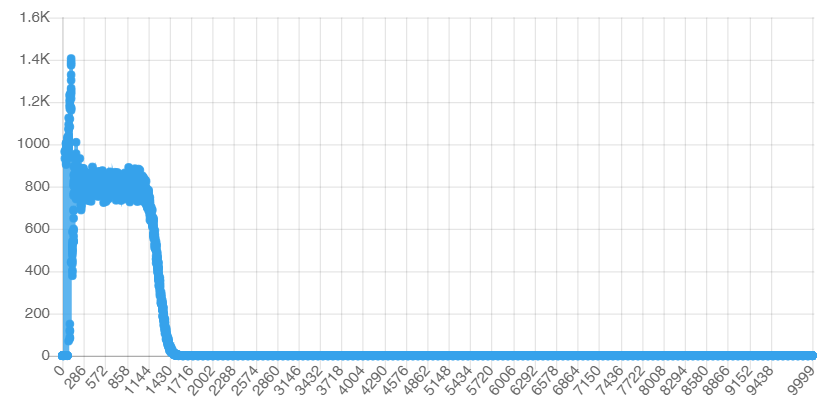
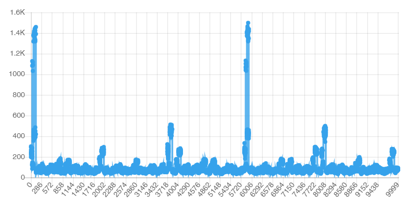
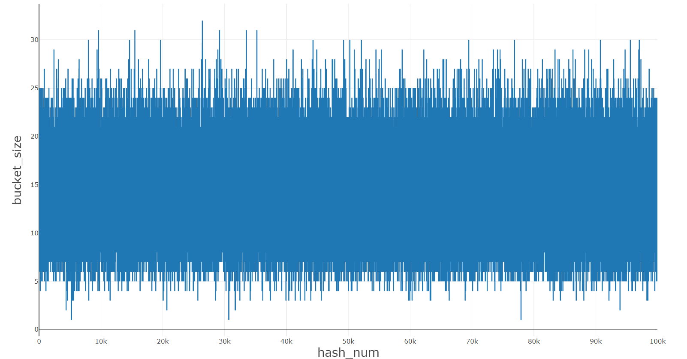

# Comparison of different hash functions

note: 
  * Amount of elements in bucket is listed on y axis, on x axis - index of bucket.
  * Functions were tested on 1.4 * 1e6 amount of elements and expansion coef = 2
  * Hashmap buckets count was forced to be constant = 1e5

## Here is comparison:

* ### Ascii hash code:
  Use first symbol as hash code
  ```
  uint64_t asciiHashCode(char* str) {
    // uint64_t hash = 1234;
    // printf("%d\n", str[0]);
    return str[0]; 
  }
  ```
  results:
  

* ### Const one hash code:
  Use first symbol as hash code
  ```
  uint64_t asciiHashCode(char* str) {
    return str[0]; 
  }
  ```
  results:
  

* ### string len hash code:
  Use string len as hash code
  ```
  uint64_t strlenHashCode(char* str) {
    uint64_t hash = 1234;
    
    return hash + strlen(str);
  }
  ```
  resulst: 
  

* ### Sum of string chars hash code:
  Use sum of characters in string as hash code
  ```
  uint64_t sumHashCode(char* str) {
    uint64_t hash = 0;
    while (*str) {
        hash += *(str++);
    }
    return hash;
  }
  ```
  resulst: 
  

* ### Rolling hash code:
  Use rolling hash algroritm
  ```
  uint64_t rollHashCode(char* str) {
    uint64_t hash = str[0];
    while (*str) {
        hash = ((hash >> 1) | (hash << 63)) ^ *(str++);
    }
    return hash;
  }
  ```
  resulst:
  

* ### My hash code:
  ```
  uint64_t strHashCode(char* str) {
    uint64_t hash = 1234;
     while (*str) {
          hash = ((hash << 7) + hash) ^ *(str++);
     }
     return hash;
  }
  ```
  resulst:
  

